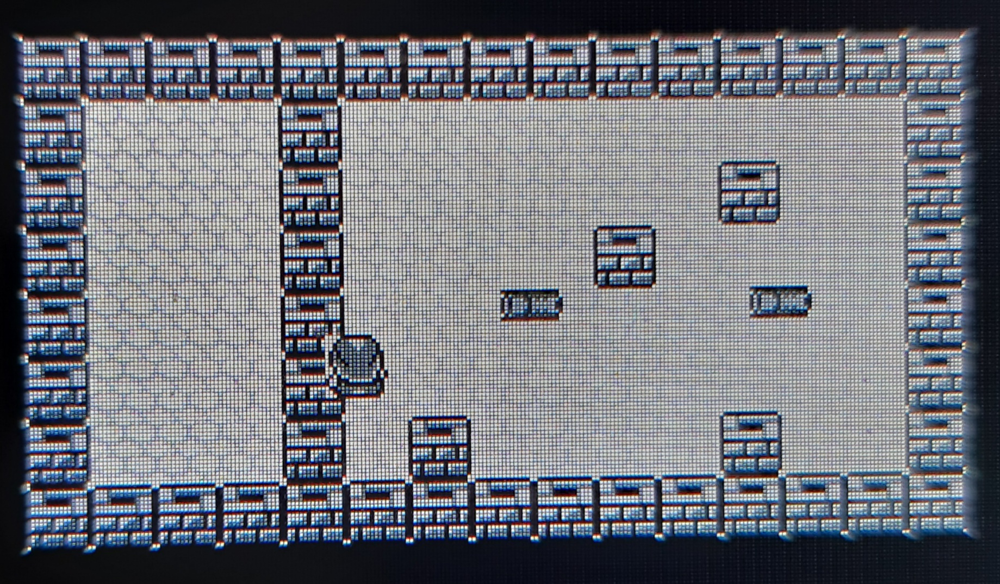

# XtsRpiPico

**Xtase - fgalliat @Aug 2021**

 - Various projects on Rpi PICO (microPython)

 - **(took from web)**
	 - ili9341.py : ILI9341 Screen lib
	 - sdcard.py : SdCard lib
 - **(my work)**
	 - buzzer.py : Buzzer lib
	 - joypad.py : Analog Stick lib
	 - fb_v200.py : FrameBuffer driver
	 
 - **moon.py**
	- MoonLightRising miniRPG

